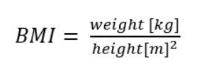

## Task 2

Write an application calculating BMI (Body Mass Index) and checking if it’s optimal or not.
Your application should read two variables: weight (in kilograms, type float) and height
(in centimeters, type int). BMI should be calculated given following formula:

The optimal BMI range is from 18.5 to 24.9, smaller or larger values are non-optimal
values. Your program should write "BMI optimal" or "BMI not optimal", according to the
assumptions above.

Optional challenge: Round the number to 2 nearest decimal places (eg: 21.879323 will round up to 21.88)