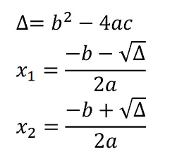
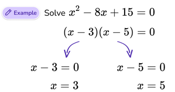

## Task 3

Write a program for solving a quadratic equation. The program should take three integers
(coefficients of the quadratic equation a, b, c) and calculate the roots of the
equation.

If delta ∆ comes out negative, print "Delta negative" and exit the program.
Formulas you’ll need:

Test data:

a = ??

b = ??

c = ??

x1 = ??

x2 = ??

