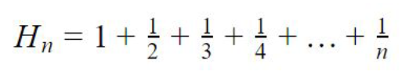

## Task 6

Write an application that takes a number n from the user (type int) and calculates the
sum of the harmonic series from 1 to n, according to the formula below:

Check if your solution is correct:
https://www.123calculus.com/en/harmonic-number-page-1-40-140.html

Optional challenge:
Ask for new inputs until the user writes "exit"