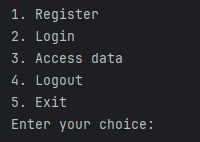

## Skipi's task 1

Write an application that will allow you to:
- Register into an application by reading username and password from user (max 3 users)
- Log in to an application by reading username and password from user
- Log out of the application
- Access data from the logged in user
- Exit the application

### Part 1 - User interface

The application will provide a user interface on the command line like so:

Requirements:
- Don't exit the application on wrong input but instead re-prompt the user and tell him "Invalid choice. Please enter a valid option."

- For now, just print out "Registering user", "Logging user in", 
"Accessing data", "Logging user out" instead of
performing real operations. Exiting the application should work.

### Part 2 - Registration

Create new class User with fields username, password, data. Don't forget to make fields private
and create a constructor and getters.

Then create a new class UserDatabase. The class will store an array of Users.

Create a method in UserDatabase class that will take care of prompting user for username
and password and then it will store this user into the array.

The registration will look like this:

The registration process will check if the username already exists and if the maximum
count of users is not reached. If username is taken, print out 
"Username is already taken. Please choose a different one."

If the maximum number of users is reached, print out 
"Maximum number of users reached. Cannot register more users."

### Part 3 - Login

Login will be very similar to register, but instead of creating a user, you will
need to check if the username and password is correct in the database.

Create a new field in UserDatabase class called loggedInUser and if the username and password
is correct, assign the user from database to loggedInUser.

### Part 4 - Access data

Enable user to access his data. If the user is logged in, print out the user's data
on the screen like so:

If the user tries to access the data but is not logged in, the application will say
"You are not logged in."

### Part 5 - Logout

Enable users to log out of the application.

If the user is not logged in but tries to log out, print out "You are not logged in."

