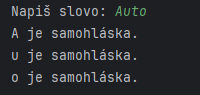

## HW 1

Write an application that will analyze a word.

- Print out each letter from the word print out "Písmeno <písmeno> je souhláska", if it's a vowel

Hints:

- In main, read the word from user using Scanner
- Create a class WorldAnalyzer with a method analyzeWord(String word)
- Pass the word to the method
- To access an individual letters in String, you can use charAt(index) method

Example: For word "Auto", the output should look like this

