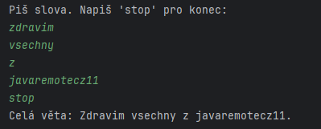

## HW 2

Write an application that will read the user's input until he writes 'stop'.

After that, print out the whole sentence that was written by user.

Don't forget to separate words with a space and add a dot at the end of the sentence.

Optional challenge: Capitalize the first letter of the first word.

Example:

Hints:

- Methods toUpperCase(), substring() and trim() might be useful
- Having separate methods for adding a word and finishing a sentence can clean up your code