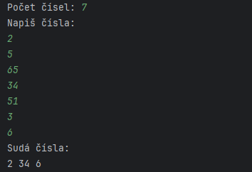

Write an application that will ask you how many numbers do you want to enter.

Then read numbers until you have enough.

From all the numbers that you read, print out all the even numbers.

Example:

