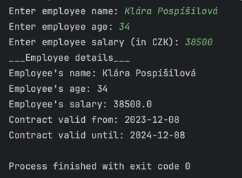

## Task 21

Write an application consisting of 3 classes:

- Main
- Employee
- Contract

The application should ask for full name, age and salary in CZK.

The application should then create a contact for the employee:

- With start date equal to today's date
- With end date equal to the same date next year
- With salary as input from user

Make a method in Employee class called printEmployeeDetails, that will
print out full information about the employee as you can see on this example:

